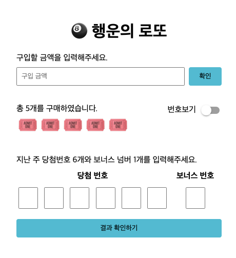

<p align="middle" >
  
</p>
<h2 align="middle">level1 - 행운의 로또</h2>
<p align="middle">자바스크립트로 구현 하는 로또 어플리케이션</p>
<p align="middle">
  
  
  
  
  
</p>

## 🔥 Projects!

<p align="middle">
  
</p>

### 🎯 step1 구입 기능

- [ ] 로또 구입 금액을 입력하면, 금액에 해당하는 로또를 발급해야 한다.
- [ ] 로또 1장의 가격은 1,000원이다.
- [ ] 소비자는 **자동 구매**를 할 수 있어야 한다.
- [ ] 복권 번호는 번호보기 토글 버튼을 클릭하면, 볼 수 있어야 한다.


### 🎯🎯 step2 당첨 결과 기능

- [ ] 결과 확인하기 버튼을 누르면 당첨 통계, 수익률을 모달로 확인할 수 있다.
- [ ] 로또 당첨 금액은 고정되어 있는 것으로 가정한다.
- [ ] 다시 시작하기 버튼을 누르면 초기화 되서 다시 구매를 시작할 수 있다.


### 🎯🎯🎯 step3 수동 구매

- [ ] 소비자는 수동 구매(스스로 구매 번호를 입력)를 할 수 있어야 한다.
  - 수동 구매를 위한 input UI는 스스로 구현한다.
- [ ] 수동 구매 후 남는 금액이 있다면 자동으로 구매할 수 있어야 한다.
- [ ] 위 기능들이 정상적으로 동작하는지 Cypress를 이용해 테스트한다.

<br><br>

### 🔽 기능 구현 목록

#### /* 구입 기능 */
- [ ] 구입 금액을 입력 받는다.
- [ ] 구입 금액은 숫자여야 한다.
- [ ] 구입 금액은 1000원 단위여야 한다.
- [ ] 잘못된 입력이 들어왔을 때 에러 처리
- [ ] 자동 구매 입력 시 랜덤으로 번호 6개 뽑기
- [ ] 뽑힌 6개의 번호 유요한 복권 번호인지 확인
- [ ] 구입한 개수에 따라서 몇 개를 구매했는지 업데이트
- [ ] 구매한 개수에 따라서 복권 이미지 업데이트
- [ ] 번호보기 버튼 클릭 시, 구매한 개수에 따른 복권 번호 출력
- [ ] 복권 번호 출력을 위한 레이아웃 구성
- [ ] 다시 번호보기 토글 버튼 클릭 시, 복권 번호들이 사라지고 다시 원래대로 돌아오기

#### /* 당첨 결과 기능 */
- [ ] 당첨 번호 와 보너스 번호를 입력 받는다.
- [ ] 당첨 번호 와 보너스 번호가 중복되는지 확인
- [ ] 당첨 번호 와 보너스 번호가 범위 내의 번호인지 확인
- [ ] 당첨 번호 와 보너스 번호가 숫자 인지 확인
- [ ] 당첨 통계 및 수익률을 표시할 모달 창 레이아웃 구성
- [ ] 구매한 개수에 따른 통계 및 수익률 계산
- [ ] 미리 당첨 등수에 따른 당첨금을 세팅한다.
(1등 1,000,000원 :: 2등 500,000원 :: 3등 100,000원 :: 4등 50,000원 :: 5등 5,000원)
- [ ] 당첨 번호의 개수에 따라서 등수를 계산한다.
(모두 동일하면 1등, 보너스 번호와 숫자 5개가 같으면 2등, 숫자 5개가 같으면 3등, 숫자 4개가 같으면 4등, 숫자 3개가 같으면 5등, 이하 낙첨)
- [ ] 모달 창을 띄우고 모달 창 위에 계산된 통계 및 수익률 출력
- [ ] 다시 시작하기 버튼 구성
- [ ] 다시 시작하기 버튼 클릭 시 모든게 초기화 되고 처음 화면으로 돌아가기
- [ ] 다시 시작히기 버튼도 모달 창 위에 표시
- [ ] 모달 창 활성화 시, 모달 창 위를 제외하고 다른 버튼은 비활성화

#### /* 수동 구매 */
- [ ] 수동 구매 후 남는 금액을 확인하기 위해 현재 보유 금액이 표시되는 부분 구성
- [ ] 돈을 추가할 수 있는 버튼 구성
- [ ] 돈이 없을 때 자동, 수동 불문하고 구매할 수 없는 기능
- [ ] 수동 구매를 위해 번호를 입력할 수 있는 레이아웃 구성
- [ ] 구매를 확인할 수 있는 버튼 구성
- [ ] 한장 씩 수동 구매 가능하게 한번 구매 시 1000원 차감
- [ ] 입력된 번호가 숫자인지 확인
- [ ] 입력된 번호에 중복된 번호가 있는지 확인
- [ ] 입력된 번호가 로또 숫자 범위 내의 숫자들인지 확인
- [ ] 잘못된 입력이 들어왔을 때 에러처리


<br><hr>

## ⚙️ Before Started

####  로컬에서 서버 띄워서 손쉽게 static resources 변경 및 확인하는 방법

로컬에서 웹서버를 띄워 html, css, js 등을 실시간으로 손쉽게 테스트해 볼 수 있습니다. 이를 위해서는 우선 npm이 설치되어 있어야 합니다. 구글에 `npm install` 이란 키워드로 각자의 운영체제에 맞게끔 npm을 설치해주세요. 이후 아래의 명령어를 통해 실시간으로 웹페이지를 테스트해볼 수 있습니다.

```
npm install -g live-server
```

실행은 아래의 커맨드로 할 수 있습니다.

```
live-server 폴더명
```

<br>

## 👏 Contributing

만약 미션 수행 중에 개선사항이 보인다면, 언제든 자유롭게 PR을 보내주세요.

<br>

## 🐞 Bug Report

버그를 발견한다면, [Issues](https://github.com/woowacourse/javascript-lotto/issues)에 등록해주세요.

<br>

## 📝 License

This project is [MIT](https://github.com/woowacourse/javascript-lotto/blob/main/LICENSE) licensed.
